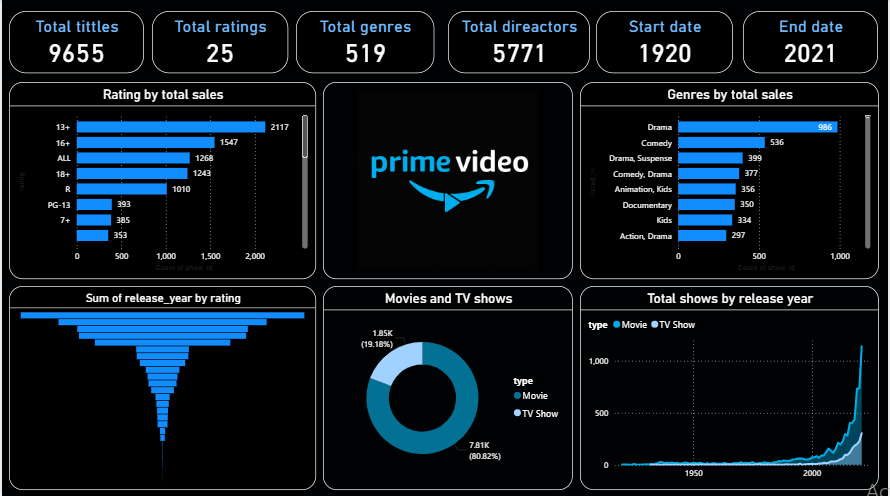

🎬 Amazon Prime Video Content Analysis Dashboard (Power BI)

📌 Project Overview

This project presents an interactive Power BI dashboard analyzing Amazon Prime Video content data. The objective is to explore content distribution, genre performance, rating classification, and release trends to uncover insights about streaming content growth and audience targeting.

The dashboard provides a clear overview of movies and TV shows available on the platform and highlights content trends over time.
📊 Dashboard Preview

🎯 Business Problem

Streaming platforms need to understand

Content distribution by genre and rating

Growth trends in movies vs TV shows

Audience-targeted rating classifications

Release year trends

Content diversity and expansion patterns

This dashboard helps stakeholders analyze content strategy and identify trends in streaming platform expansion.

📂 Dataset Information

Total Titles: 9,655

Total Genres: 519

Total Ratings Categories: 25

Release Year Range: 1920 – 2021

Key Fields Included:

Title

Genre

Rating

Type (Movie / TV Show)

Release Year

Director

🛠 Tools & Technologies Used

Power BI

Data Modeling

DAX Measures

KPI Cards

Slicers & Filters

Interactive Visualizations

🔄 Data Modeling Approach

Built data relationships between title, genre, and rating columns

Created calculated measures using DAX for:

Total Titles

Total Ratings

Genre Count

Content Type Distribution

Used aggregation measures to analyze content trends by rating and release year

📊 Key KPIs Displayed

Total Titles: 9,655

Total Ratings Categories: 25

Total Genres: 519

Total Directors

Start Year: 1920

End Year: 2021

📈 Dashboard Features

Rating-wise content distribution

Genre-wise total content analysis

Movie vs TV Show percentage split

Release year trend analysis

Content growth over time

Interactive filters for dynamic exploration

🔍 Key Insights

Movies account for approximately 80% of total content

Drama is the most dominant genre by total titles

Significant content growth observed after 2000

13+ and 16+ ratings represent large portions of content

Rapid expansion in TV shows in recent years

Focus on TV show expansion given recent growth trend

Analyze audience preference trends for future content acquisition
